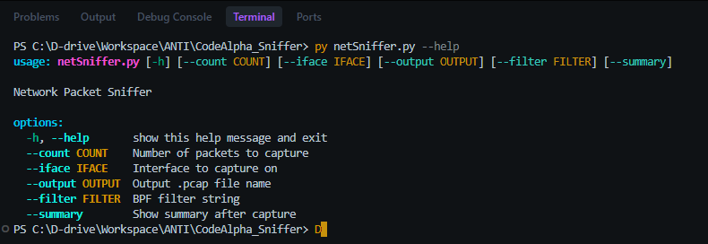

# Network Packet Sniffer

A simple and effective Python-based network packet sniffer built with the `scapy` library. This tool allows you to capture network traffic, display it in a structured tabular format in the console, generate traffic summaries, and save the captured packets to a PCAP file for further analysis.

## Features

- Real-time display of captured network packets (Time, Protocol, Source IP, Destination IP, Ports).
- Supports parsing of various protocols including TCP, UDP, DNS, ICMP, and ARP.
- Supports both IPv4 and IPv6 traffic.
- Capture network statistics and generate a summary (top source/destination IPs, protocol distribution) upon completion.
- Save captured packets to a `.pcap` file for use in tools like Wireshark.
- Filter traffic using Standard BPF (Berkeley Packet Filter) syntax.

## Prerequisites

- Python 3.x
- `scapy` library

You can install the required dependency using pip:
```bash
pip install scapy 
```

## Usage

Run the script from the command line:

```bash
python netSniffer.py [OPTIONS]
```

### Available Options

* `--count` : Number of packets to capture. (Default: 10)
* `--iface` : The network interface to capture traffic on. (Default: "Wi-Fi")
* `--output`: The output file name to save captured packets as a `.pcap` file. Do not include the extension. Leave empty to not save. (Default: Empty)
* `--filter`: A standard BPF (Berkeley Packet Filter) string to filter specific traffic (e.g., "tcp", "udp", "port 80"). (Default: Empty)
* `--summary`: A flag that, when included, will display a summary of the network traffic after reaching the packet capture limit.

## Examples

**1. Basic Capture**
Capture 50 packets on the default "Wi-Fi" interface:
```bash
python netSniffer.py --count 50
```

**2. Interface and Summary**
Capture 100 packets on the "eth0" interface and display a summary at the end:
```bash
python netSniffer.py --iface eth0 --count 100 --summary
```

**3. Filtering Traffic**
Capture only UDP traffic limit it to 200 packets:
```bash
python netSniffer.py --filter "udp" --count 200
```

**4. Saving to PCAP**
Capture TCP traffic on port 443 and save it to a file named `capture_https.pcap`:
```bash
python netSniffer.py --filter "tcp port 443" --output capture_https
```
